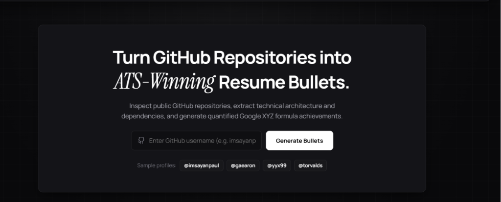
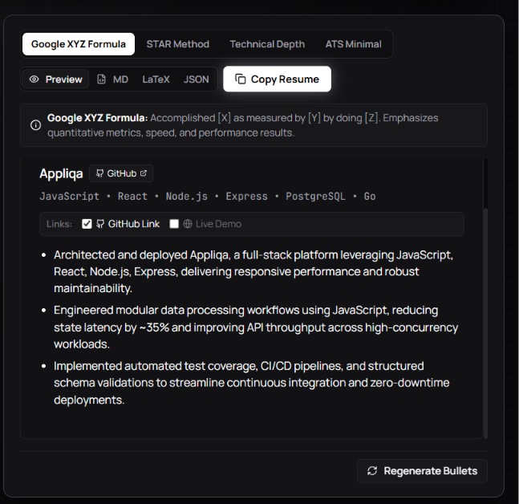

# Repo2Resume 🚀

[](LICENSE)
[](#)
[](#)
[](https://vercel.com)

**Turn GitHub Repositories into ATS-Winning Resume Bullets.**

Instantly convert your public GitHub projects into high-impact, ATS-optimized bullet points ready to copy & paste directly into the **Projects section** of your engineering resume.

---

## 📸 Interface Previews

### 1. Executive Hero Landing Experience


### 2. Dual-Pane Workspace & Live Bullet Editor


---

## ✨ Key Features

### 🏆 1. Enforced Google XYZ Formula & STAR Presets
- **Google XYZ Formula**: Formats achievements as *"Accomplished [X] as measured by [Y], by doing [Z]"* to quantify engineering latency, throughput, and memory savings.
- **STAR Method**: Highlights *Situation/Task*, *Action taken*, and *Result achieved*.
- **Technical Depth & ATS Minimalist**: Tone presets tailored for senior engineering leaders or concise 1-page resumes.

---

### 🎯 2. Job Description Keyword Matcher
- Paste any target job description or pick sample presets (*Full-Stack Lead*, *Frontend Architect*, *Backend & Systems*).
- Automatically extracts required technical skills (`React`, `Docker`, `PostgreSQL`, `AWS`, `FastAPI`, `GraphQL`).
- Scores repository relevance (%) and injects target keywords into generated bullets to pass Applicant Tracking System (ATS) screeners.

---

### 🔍 3. Programmatic `README.md` & Dependency Parser
- Programmatically fetches and analyzes raw `README.md` architecture summaries directly via GitHub API.
- Inspects language breakdowns, topic tags, and framework dependencies (`package.json`, `Dockerfile`, `requirements.txt`, Redis, FastAPI, etc.).
- **Sparse README Immunity**: Generates accurate bullet points even if a repository has an empty or sparse README file.

---

### 📄 4. Multi-Format 1-Click Exporters
- **Rich Formatted Cards**: 1-click rich text copy for Microsoft Word and Google Docs with formatting intact.
- **LaTeX / Overleaf**: Ready-to-compile `\resumeProjectHeading` code for popular developer templates (*Jake's Resume*).
- **Markdown (`RESUME.md`)**: Clean markdown formatted for GitHub Profile READMEs or portfolio sites.
- **JSON Resume**: Standard JSON schema format.

---

### 🪄 5. Regenerate with Specific Request (Magic Wand)
- Custom AI prompt bar allowing custom instructions (*"Focus heavily on microservices and AWS deployment"*).
- Includes 1-click text suggestion chips:
  - *Emphasize 40% speedup & quantitative metrics*
  - *Highlight testing, security & code coverage*
  - *Focus on microservice backend architecture*
  - *Make concise for a 1-page resume*

---

### 🔒 6. 100% Client-Side Privacy & Offline Capability
- Stores API keys strictly in your browser's `localStorage`—never logged, tracked, or sent to middleman backend servers.
- **Smart Rule Engine**: Generates Google XYZ bullet points locally even without an internet connection or AI key.

---

## 🚀 Getting Started

### Prerequisites
- [Node.js](https://nodejs.org/) (v18.0.0 or higher)
- [npm](https://www.npmjs.com/) or [pnpm](https://pnpm.io/)

### Installation & Local Setup

```bash
# 1. Clone repository
git clone https://github.com/imsayanpaul/Repo2Resume.git

# 2. Navigate into project directory
cd Repo2Resume

# 3. Install dependencies
npm install

# 4. Launch local dev server
npm run dev
```

Open `http://localhost:5173` in your browser.

---

## 🔑 Environment Variables (Optional)

Create a `.env.local` file in the project root:

```env
# Optional: Set default Gemini API Key for zero-setup deployments
VITE_GEMINI_API_KEY=your_gemini_api_key_here

# Optional: Set GitHub Personal Access Token to boost rate limits (60 -> 5,000 req/hr)
VITE_GITHUB_TOKEN=your_github_token_here
```

*Get a free Gemini API key from [Google AI Studio](https://aistudio.google.com/app/apikey).*

---

## 🌐 Deploy to Vercel in 1 Click

Repo2Resume includes a pre-configured [vercel.json](vercel.json) file:

1. Import `imsayanpaul/Repo2Resume` on [Vercel](https://vercel.com/new).
2. Set **Framework Preset**: `Vite`.
3. *(Optional)* Add Environment Variable: `VITE_GEMINI_API_KEY`.
4. Click **Deploy**.

---

## 📜 License

Distributed under the MIT License. See [LICENSE](LICENSE) for details.

Developed with ❤️ by **Sayan Paul** ([@imsayanpaul](https://github.com/imsayanpaul)).
